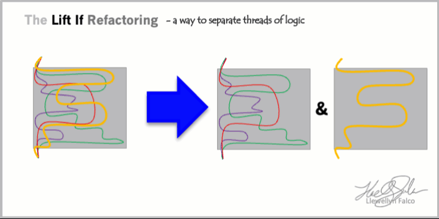

# Lift If Refactoring

## Talk Resources

* Steps
  1. Get 100% code coverage
  1. Copy in to both sides of an `if/else` statement
  1. change conditional to separate the thread
  1. Rerun code coverage
  1. Delete the red (uncovered blocks)
* Video's showing it in action:
  * [From 0% to Cleanly Refacted 100% tested code](https://www.youtube.com/watch?v=wp6oSVDdbXQ)  - Craft 2019 
## Llewellyn's <!-- include: llewellyn.md -->

* [Blog](http://llewellynfalco.blogspot.com/)
* [ApprovalTests](https://github.com/approvals/)
* [YouTube](https://www.youtube.com/user/isidoreus/videos)
* [Twitch](https://www.twitch.tv/llewellynfalco)
* [Learn With Llew](https://github.com/LearnWithLlew)

I'm a Technical Agile Coach. You can [hire me](http://llewellynfalco.blogspot.com/p/hire-me.html)
 <!-- endInclude -->

## Given at:
* 2022-06-09 [Craft](https://craft-conf.com/) - [Video](https://www.youtube.com/watch?v=uRP4BO8pA8M)
